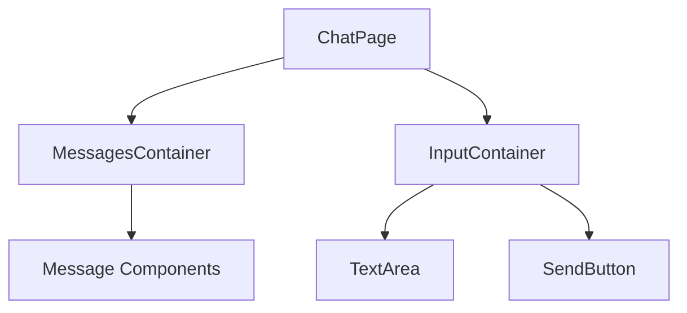

# Chat Interface Implementation Plan

## Overview
This document outlines the plan for implementing a ChatGPT-style interface in the Loop frontend application. The interface will allow users to send messages to an LLM and receive responses in real-time.

## Architecture

### Component Structure


## Implementation Phases

### Phase 1: UI Implementation
1. Create chat container with messages display area
   - Implement scrollable message container
   - Style user messages with gray bubbles
   - Style LLM responses with white text
2. Add fixed input area at bottom
   - Implement NextUI TextArea component
   - Add send button with proper styling
   - Ensure proper spacing and layout

### Phase 2: State Management
1. Message State Structure
   ```typescript
   interface Message {
     id: string;
     content: string;
     type: 'user' | 'llm';
     timestamp: Date;
   }
   ```
2. State Management Implementation
   - Use useState for managing message history
   - Handle message input changes
   - Implement send message functionality

### Phase 3: Backend Integration
1. API Integration Points
   - POST /api/chat/send - Send user message
   - GET /api/chat/responses - Receive LLM responses
2. Real-time Updates
   - Implement message sending to backend
   - Handle response streaming/updates
   - Error handling and retry logic

## Technical Specifications

### UI Components
- Message Container: Flexbox layout with column direction
- User Messages: Gray background (#f3f4f6), rounded corners
- LLM Messages: White text, no background
- Input Area: Fixed position at bottom, full width
- Send Button: Primary color, disabled when input empty

### State Management
- Message History: Array of Message objects
- Current Input: Controlled component state
- Loading States: Handle message sending/receiving

### Backend Integration
- RESTful API endpoints
- Authentication headers
- Error handling and retry logic

## Next Steps
1. Clean up existing page.tsx
2. Implement basic UI components
3. Add state management
4. Set up message display
5. Implement input handling
6. Style according to requirements
7. Prepare for backend integration